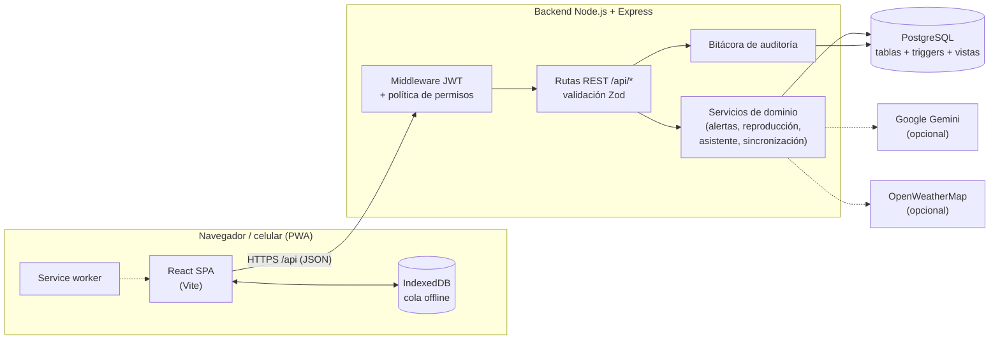
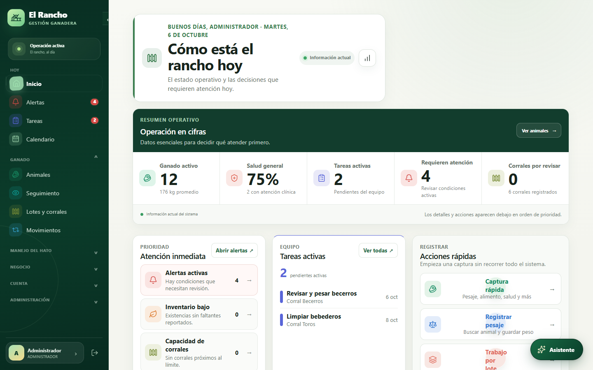
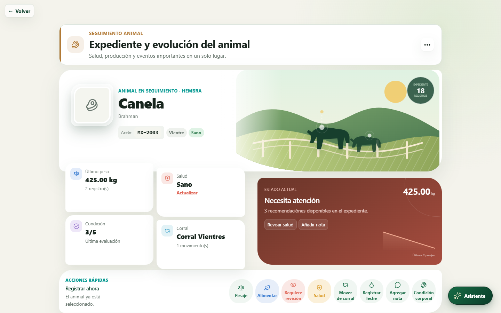
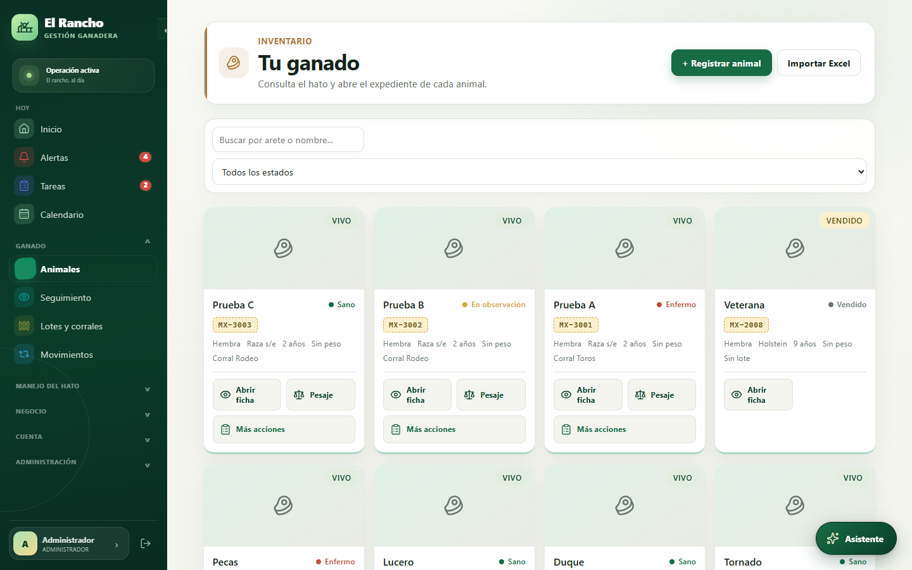
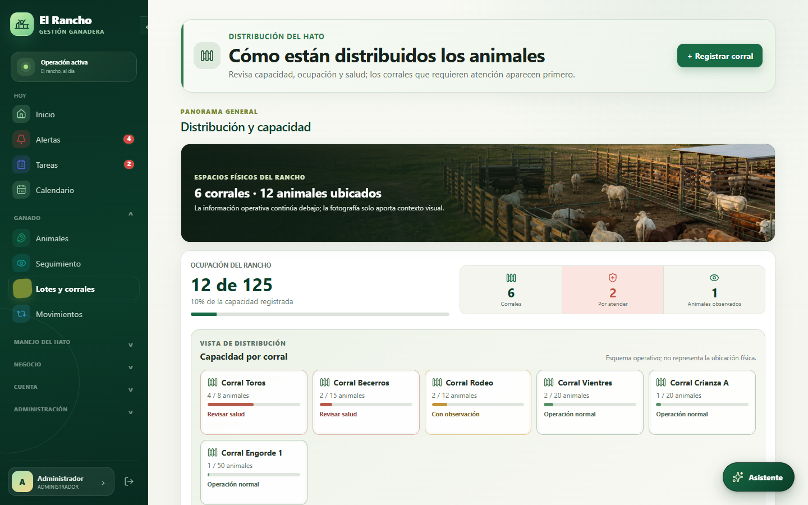
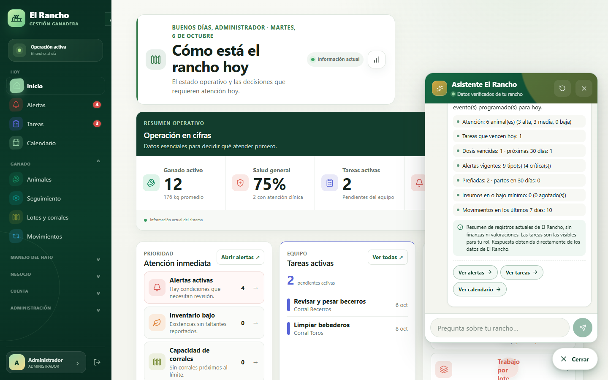
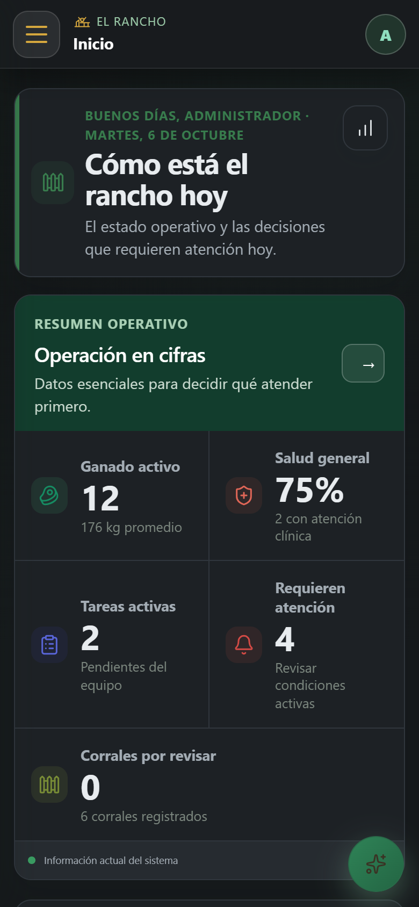

# 🐄 El Rancho — Sistema Inteligente de Gestión Ganadera


Aplicación web full-stack para administrar un rancho ganadero (bovinos): inventario
de animales, salud, reproducción, alimentación, pesajes, corrales, ventas, compras,
finanzas y reportes. Funciona en computadora y celular, incluso **sin conexión** en
campo, y sincroniza cuando vuelve la señal.

> **Proyecto desarrollado para un cliente real** del sector ganadero. Este
> repositorio contiene únicamente el código fuente, el esquema de base de datos,
> las migraciones y **datos de ejemplo ficticios**. No incluye información, fotos,
> credenciales ni bases de datos del cliente.

### En resumen

- **Full-stack de punta a punta:** React + Vite en el frontend, API REST en Node.js +
  Express y PostgreSQL con reglas de negocio en la propia base de datos.
- **Seguridad real:** autenticación JWT, 4 roles con una matriz de permisos
  centralizada, validación de entradas con Zod y bitácora de auditoría.
- **Uso en campo:** aplicación instalable (PWA) que funciona sin conexión y
  sincroniza al reconectar.
- **Calidad:** más de 630 pruebas automatizadas, incluidas pruebas de integración
  contra PostgreSQL real.

---

## Índice

- [Qué problema resuelve](#qué-problema-resuelve)
- [Funcionalidades principales](#funcionalidades-principales)
- [Funcionalidades destacadas](#funcionalidades-destacadas)
- [Tecnologías](#tecnologías)
- [Arquitectura](#arquitectura)
- [Estructura del repositorio](#estructura-del-repositorio)
- [Instalación local](#instalación-local)
- [Variables de entorno](#variables-de-entorno)
- [Base de datos](#base-de-datos)
- [Pruebas](#pruebas)
- [Seguridad y roles](#seguridad-y-roles)
- [Capturas de pantalla](#capturas-de-pantalla)
- [Documentación adicional](#documentación-adicional)

---

## Qué problema resuelve

En muchos ranchos la información de cada animal (vacunas, pesos, partos, consumo de
alimento, ventas) vive en libretas y hojas sueltas. **El Rancho** reúne todo en una
**bitácora por animal**: cada evento registrado (pesaje, tratamiento, monta, parto,
movimiento de corral, venta…) apunta al animal y se presenta como una línea de
tiempo única, junto con recomendaciones y la rentabilidad estimada del animal.

## Funcionalidades principales

| Área | Qué incluye |
|---|---|
| **Animales** | Alta individual o importación desde Excel, ficha con foto, genealogía con aviso de consanguinidad, estado de salud, categoría productiva, exportación a PDF y código QR por animal. |
| **Seguimiento** | Espacio dedicado por animal con historial cronológico completo, recomendaciones automáticas y diario de notas del equipo. |
| **Salud** | Eventos sanitarios, planes sanitarios por lote, vacunas próximas a vencer y alertas. |
| **Reproducción** | Montas/inseminaciones, diagnósticos de gestación, partos con registro de crías, captura masiva, analítica reproductiva y costos. |
| **Pesajes y condición corporal** | Curvas de peso, ganancia diaria, condición corporal (escala 1–5) y producción de leche. |
| **Corrales y movimientos** | Ocupación vs. capacidad, traslados y registro automático de cada movimiento. |
| **Alimentación e insumos** | Consumo por animal o por lote con descuento automático de inventario, alertas de stock bajo y caducidad. |
| **Comercial y finanzas** | Ventas individuales y por lote, compras de animales e insumos, gastos generales, terceros, reportes de ingresos y rentabilidad. |
| **Operación** | Tareas asignadas al equipo, calendario, alertas centralizadas, corte diario por correo y bitácora de auditoría. |
| **Asistente con IA** | Chat en lenguaje natural para consultar el estado del rancho (opcional, Google Gemini). |

## Funcionalidades destacadas

- **Ficha 360° del animal** — `GET /api/animales/:id/historial` reúne en paralelo
  pesajes, salud, alimentación, reproducción, leche, movimientos, condición corporal
  y cambios de categoría en una sola línea de tiempo, con recomendaciones y
  rentabilidad calculadas.
- **Trabajo en campo sin conexión (PWA)** — la app se instala en el celular, guarda un
  catálogo mínimo en IndexedDB y encola capturas (pesajes, alimentación,
  movimientos) con identificadores idempotentes; al reconectar las sincroniza y
  muestra conflictos de forma comprensible.
- **Reglas de negocio en la base de datos** — triggers de PostgreSQL impiden exceder
  la capacidad de un corral, registrar eventos antes del nacimiento o en el futuro,
  usar insumos caducados o consumir más inventario del disponible.
- **Recomendaciones trazables** — las alertas y sugerencias son reglas explícitas
  sobre datos registrados (no una caja negra), con umbrales configurables desde la
  interfaz.
- **Asistente consultivo con IA y control de permisos** — resuelve localmente las
  preguntas frecuentes sin consumir la API, usa *function calling* con herramientas
  validadas con Zod y respeta los permisos del rol de quien pregunta. Si la API de IA
  falla, responde en modo degradado.
- **Operaciones atómicas y auditoría** — ventas, ventas por lote y compras se ejecutan
  en transacciones; la bitácora de auditoría se escribe en la misma transacción con
  estado anterior/posterior.
- **Interfaz responsive y accesible** — diseño para escritorio y celular, temas claro
  y oscuro, tamaño de texto, densidad y contraste configurables.

## Tecnologías

**Frontend**
- React 18 + Vite (JavaScript/JSX)
- React Router
- PWA con *service worker* propio e IndexedDB (`idb`) para el modo sin conexión
- Recharts (gráficas), jsPDF (PDF), `read-excel-file` / `write-excel-file` (Excel), lucide-react (iconos)
- CSS propio con *design tokens* (sin framework de UI)

**Backend**
- Node.js + Express (CommonJS)
- PostgreSQL con `pg` (consultas SQL parametrizadas, sin ORM)
- Autenticación con JWT + contraseñas con bcrypt
- Validación de datos con Zod
- `express-rate-limit`, CORS restringido, `multer` (fotos), `node-cron` (tareas programadas), `nodemailer` (correo)
- Integraciones opcionales: Google Gemini (asistente) y OpenWeatherMap (clima)

**Base de datos**
- PostgreSQL 13+: más de 40 tablas, funciones y triggers con reglas de negocio, y una vista para la ficha del animal
- Migraciones versionadas propias con checksum SHA-256, transacciones y *advisory lock*

**Calidad**
- Más de 630 pruebas automatizadas con el *test runner* nativo de Node (`node:test`):
  unitarias, de API con Supertest e integración contra un PostgreSQL real aislado

> El proyecto está escrito en **JavaScript** (no TypeScript) y **no usa Docker**.

## Arquitectura



- **Tres capas independientes** (`database/`, `backend/`, `frontend/`), cada una con
  sus propias dependencias.
- El backend expone una API REST: cada recurso tiene su módulo en
  `backend/src/routes/` y se monta en `/api/<recurso>`. Solo `/api/auth` es pública.
- Cada petición autenticada recarga rol y estado del usuario desde PostgreSQL, así que
  desactivar una cuenta o cambiar su rol surte efecto de inmediato.
- Las reglas críticas viven en **triggers de PostgreSQL** y además se validan en la API;
  los errores de esas reglas se devuelven como HTTP 409 con mensajes claros.
- El frontend usa un único cliente HTTP (`src/api.js`) y carga cada módulo de forma
  diferida para que la app arranque rápido en celulares.

## Estructura del repositorio

```text
el-rancho/
├── backend/                  API REST (Node.js + Express)
│   ├── src/
│   │   ├── app.js            Composición de Express (middlewares y rutas)
│   │   ├── server.js         Arranque del servidor y tareas programadas
│   │   ├── routes/           Un módulo por recurso REST
│   │   ├── authorization/    Matriz central de permisos por rol
│   │   ├── middleware/       Autenticación, manejo de errores
│   │   ├── validation/       Esquemas Zod
│   │   └── *Service.js       Lógica de dominio (alertas, reproducción, asistente…)
│   ├── scripts/              Migraciones y utilidades de pruebas
│   ├── test/                 Pruebas unitarias e integración
│   └── .env.example          Plantilla de configuración
├── frontend/                 SPA React + Vite (PWA)
│   ├── src/
│   │   ├── components/       Pantallas y modales
│   │   ├── offline/          Cola de operaciones, IndexedDB y sincronización
│   │   ├── auth/ context/    Sesión, módulos activos, alertas
│   │   └── api.js            Cliente HTTP único
│   ├── public/               Íconos, manifest e imágenes
│   ├── scripts/              Service worker, HTTPS local, utilidades de build
│   └── test/                 Pruebas del frontend
├── database/
│   ├── schema.sql            Esquema completo (baseline)
│   ├── migrations/           Migraciones versionadas NNNN_nombre.sql
│   ├── seed.sql              Datos de ejemplo ficticios
│   └── datos_prueba_*.sql    Escenarios de demostración ficticios
├── docs/                     Funcionalidades, guía técnica, modo offline y lanzador
│   └── screenshots/          Capturas usadas en este README
├── scripts/                  Lanzador local para Windows (PowerShell)
└── EL RANCHO - *.bat         Accesos directos del lanzador
```

## Instalación local

### Requisitos

- Node.js 20.19+ o 22.12+ y npm (lo exige Vite 8)
- PostgreSQL 13 o superior
- Git

### 1. Clonar

```bash
git clone https://github.com/alcarrera-md/el-rancho.git
cd el-rancho
```

### 2. Crear la base de datos

```bash
createdb sistema_ganadero
```

### 3. Backend

```bash
cd backend
npm install
cp .env.example .env        # en Windows: copy .env.example .env
```

Edita `backend/.env` con tus datos de conexión y un `JWT_SECRET` propio (ver
[Variables de entorno](#variables-de-entorno)). Luego crea el esquema y arranca la API:

```bash
npm run migrate:init        # instala el esquema en la base vacía
npm run migrate:status      # verifica que no haya migraciones pendientes
npm run dev                 # API en http://localhost:3000
```

### 4. Roles, usuario inicial y datos de ejemplo

El orden importa: `seed.sql` crea los cuatro roles que necesita el usuario inicial.

```bash
psql -d sistema_ganadero -f ../database/seed.sql                    # roles + datos ficticios
psql -d sistema_ganadero -f ../database/migracion_login.sql         # Administrador inicial
psql -d sistema_ganadero -f ../database/datos_prueba_completos.sql  # (opcional) más datos de demo
```

Usuario inicial: `admin@rancho.com` / `CambiaEstaClave123`. **Cámbiala al entrar**
(Usuarios → Restablecer clave) y nunca uses esta contraseña en un servidor real.

### 5. Frontend

En otra terminal:

```bash
cd frontend
npm install
npm run dev                 # http://localhost:5173
```

Vite redirige `/api` y `/uploads` al backend en `127.0.0.1:3000`, por lo que no hace
falta configurar CORS en desarrollo. Para producción: `npm run build`.

## Variables de entorno

La configuración vive en `backend/.env` (plantilla: [`backend/.env.example`](backend/.env.example)).
El frontend no necesita variables de entorno.

| Variable | Obligatoria | Descripción |
|---|---|---|
| `PORT` | No | Puerto de la API (por defecto `3000`). |
| `NODE_ENV` | No | `production` restringe CORS a `CORS_ORIGINS`. |
| `DATABASE_URL` | **Sí** | Conexión PostgreSQL de la aplicación. |
| `MIGRATION_DATABASE_URL` | Para migrar | Conexión usada por `npm run migrate:*` (nunca toma `DATABASE_URL` como respaldo). |
| `JWT_SECRET` | **Sí** | Secreto para firmar sesiones. Mínimo 32 caracteres; el servidor rechaza valores de ejemplo. |
| `CORS_ORIGINS` | En producción | Orígenes permitidos, separados por coma. |
| `AUTH_RATE_LIMIT_MAX` / `AUTH_RATE_LIMIT_WINDOW_MINUTES` | No | Límite de intentos de inicio de sesión. |
| `GEMINI_API_KEY`, `GEMINI_MODEL`, `GEMINI_FALLBACK_MODEL`, `GEMINI_TIMEOUT_MS` | No | Asistente con IA. Sin clave, responde solo consultas resueltas localmente. |
| `OPENWEATHERMAP_API_KEY` | No | Panel de clima. |
| `EMAIL_REMITENTE`, `EMAIL_APP_PASSWORD` | No | Envío del corte diario por correo. |

Para las pruebas de integración se usa `backend/.env.test` (plantilla:
[`backend/.env.test.example`](backend/.env.test.example)) con una base **exclusiva** cuyo
nombre contenga `test`.

> Los archivos `.env` reales están excluidos por `.gitignore` y nunca deben subirse.

## Base de datos

- **`animal` es la entidad central.** Todas las tablas de eventos (`pesaje`,
  `evento_salud`, `alimentacion`, `evento_reproductivo`, `produccion_leche`,
  `movimiento_corral`, `condicion_corporal`…) referencian al animal, lo que permite
  reconstruir su historia completa.
- **`arete_id` es único**: es el identificador de trazabilidad del animal.
- **Reglas en triggers**: capacidad de corrales, fechas válidas, descuento automático
  de inventario, bloqueo de insumos caducados y registro automático de movimientos.
- **Migraciones versionadas** en `database/migrations/` (`NNNN_nombre.sql`), controladas
  por la tabla `schema_migrations` con checksum SHA-256, transacción por migración y
  *advisory lock*. Una migración aplicada nunca se edita.

| Comando (desde `backend/`) | Uso |
|---|---|
| `npm run migrate:init` | Instalación nueva sobre una base vacía. |
| `npm run migrate:baseline` | Registrar una instalación histórica compatible. |
| `npm run migrate:status` | Ver migraciones aplicadas y pendientes (solo lectura). |
| `npm run migrate:up` | Aplicar migraciones pendientes. |

Detalles: [`database/migrations/README.md`](database/migrations/README.md).

> El repositorio **no contiene bases de datos reales ni respaldos**. `seed.sql` y
> `datos_prueba_*.sql` usan nombres, teléfonos (`555-…`) y correos ficticios.

## Pruebas

```bash
# Backend: unitarias + integración contra PostgreSQL real aislado
cd backend
cp .env.test.example .env.test   # ajusta TEST_DATABASE_URL
npm run test-db:create
npm test

# Frontend
cd frontend
npm test
npm run build
```

La suite del backend se niega a ejecutarse si la base de pruebas no está aislada
(nombre sin `test` o igual a la de desarrollo). Cubre autenticación, validación,
permisos por rol, transacciones, concurrencia, migraciones, sincronización offline y
el asistente. Más información en [`backend/TESTING.md`](backend/TESTING.md).

## Seguridad y roles

| Rol | Permisos |
|---|---|
| **Administrador** | Acceso completo: usuarios, trabajadores, configuración y finanzas. |
| **Veterinario** | Escritura clínica y reproductiva, pesajes, condición corporal, planes sanitarios; lectura general. |
| **Trabajador** | Operación de campo: animales, alimentación, pesajes, leche, tareas y notas; sin finanzas sensibles. |
| **Auditor** | Solo lectura operativa, financiera, reportes y bitácora. |

- **Autorización centralizada**: una única matriz ejecutable
  (`backend/src/authorization/policy.js`) decide cada permiso; las rutas no repiten
  listas de roles. El frontend oculta acciones por comodidad, pero el backend es quien
  aplica las reglas.
- **Sesiones**: JWT firmados con un secreto validado al arrancar; rol y estado activo
  se consultan en la base en cada petición, y las sesiones pueden revocarse.
- **Contraseñas**: hash con bcrypt, verificación también para correos inexistentes
  (no revela qué cuentas existen), bloqueo temporal tras intentos fallidos y límite de
  peticiones de inicio de sesión.
- **Entradas**: validación con Zod, SQL siempre parametrizado, límites de tamaño y tipo
  en archivos (imágenes y `.xlsx`).
- **Errores**: códigos estables que no filtran SQL, trazas ni datos de conexión.
- **Auditoría**: cada operación crítica registra actor, rol, resultado y estado
  anterior/posterior dentro de la misma transacción.
- **IA con permisos**: el asistente solo usa las herramientas que el rol del usuario
  puede consultar y nunca escribe datos.

Detalles: [`backend/AUTHORIZATION.md`](backend/AUTHORIZATION.md) y
[`backend/AUDITORIA.md`](backend/AUDITORIA.md).

## Capturas de pantalla

> Capturas tomadas con datos de demostración ficticios.

| Inicio | Ficha / seguimiento del animal |
|---|---|
|  |  |

| Inventario de animales | Corrales |
|---|---|
|  |  |

| Asistente con IA | Versión móvil (modo oscuro) |
|---|---|
|  |  |

## Documentación adicional

| Documento | Contenido |
|---|---|
| [Funcionalidades](docs/FUNCIONALIDADES.md) | Catálogo completo de lo que hace el sistema, por área. |
| [Guía técnica](docs/GUIA_TECNICA.md) | Endpoints principales, decisiones de diseño y consistencia de operaciones. |
| [Modo sin conexión](docs/MODO_OFFLINE.md) | Diseño de la PWA offline: IndexedDB, idempotencia, conflictos y recuperación. |
| [Permisos por rol](backend/AUTHORIZATION.md) | Matriz de autorización recurso × acción × rol. |
| [Auditoría](backend/AUDITORIA.md) | Contrato de la bitácora de auditoría. |
| [Pruebas](backend/TESTING.md) | Configuración y alcance de la suite del backend. |
| [Migraciones](database/migrations/README.md) | Convenciones y uso del sistema de migraciones. |
| [Lanzador para Windows](docs/INICIAR_EL_RANCHO.md) | Arranque con doble clic, uso desde el celular y demo temporal. |

## Autor

Desarrollado por **César Alejandro Carrera Medina** — [LinkedIn](https://www.linkedin.com/in/cesar-medina-6a5837310) · [GitHub](https://github.com/alcarrera-md)

## Licencia

Código publicado con fines de portafolio. Todos los derechos reservados; no se
autoriza su uso comercial sin permiso del autor.
